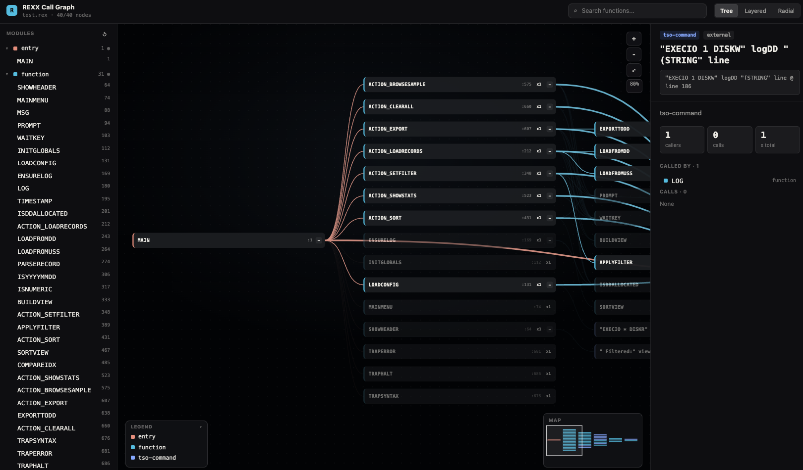

# REXX Control Flow

REXX Control Flow is a VS Code extension that visualizes procedure-level REXX call graphs and layers control-flow diagnostics on top of them.

## Features

- Generate an interactive call graph from the active REXX editor.
- Generate a workspace-wide graph across supported REXX files.
- Auto-refresh open document graphs when source content changes or is saved.
- Refresh workspace graphs when supported documents are opened, closed, changed, or saved.
- Surface diagnostics in both the graph and VS Code Problems panel.
- Show diagnostics for undefined labels, unreachable procedures, recursive cycles, dead code after unconditional exits, likely loop risks, cleanup bypass risks, and source lines over 80 columns.
- Show per-procedure complexity and fan-in/fan-out metrics.
- Search functions without losing input focus while typing.
- Keep the left module list, main graph, and right inspector synchronized when a function is selected from any of those surfaces.
- Highlight functions that are not called by another node in red; the legend shows this only when uncalled functions exist.
- Persist moved node positions across graph rerenders and panel recreation.
- Export JSON, DOT, Excalidraw, SVG, and PNG.
- Provide CodeLens shortcuts for graph generation, workspace graph generation, JSON export, and PNG export.

## Supported Graph Constructs

- Labels (`label:`) as function entries.
- `CALL label` as function-to-function edges.
- Function-style expression calls such as `Func(...)`, including calls to labels defined later in the file.
- Negated expression calls such as `\Func(...)`.
- Dynamic calls (`CALL VALUE ...`, `CALL (...)`) grouped as `DYNAMIC_CALL`.
- `SIGNAL ON ... NAME handler` as `signal-on` edges and signal-handler node tagging.
- `ADDRESS LINKMVS "program"` / `ADDRESS LINKMVS 'program'` as external-program nodes.
- Paired double-quoted TSO command statements as TSO command nodes, including quoted text continued across lines.
- Multiple statements per line separated by `;` with quote-aware splitting.
- Block and inline comment stripping before parsing.

## Usage

1. Open a REXX file.
2. Right-click in the editor.
3. Run **Generate REXX Control Flow**.

From the command palette, you can also run:

- **REXX Control Flow: Generate REXX Control Flow**
- **REXX Control Flow: Generate Workspace REXX Control Flow**
- **REXX Control Flow: Export REXX Control Flow to JSON**
- **REXX Control Flow: Export REXX Control Flow to DOT**
- **REXX Control Flow: Export REXX Control Flow to Excalidraw**
- **REXX Control Flow: Export REXX Control Flow to SVG**
- **REXX Control Flow: Export REXX Control Flow to PNG**

The editor context menu focuses on graph generation. Export actions are available from the command palette and from the graph view right-click menu.

## Graph View

- The graph opens with module navigation on the left, the graph canvas in the center, and an inspector on the right.
- Select a function from the left module list, the main graph, or the right inspector to update all three areas together.
- Use the layout switcher to choose `tree`, `layered`, or `radial`.
- The graph always uses regular node spacing; compact/comfy density controls are intentionally not exposed.
- Scroll or trackpad zooms the graph canvas.
- Drag empty canvas space to pan.
- Use the fit button to reset the viewport.
- Search highlights matching functions in place without rebuilding the whole view.
- Relationship lines use flowing curves consistently across layouts.

## Manual Layout

Manual movement is opt-in so accidental drags do not disturb the graph.

1. Right-click the graph canvas.
2. Choose **Allow Node Movement**.
3. Drag nodes with the left mouse button.
4. Release the mouse button to stop movement and save the new position.
5. Right-click and choose **Disable Node Movement** to turn movement back off.

Moved node positions persist for subsequent renders of the same graph. Right-click and choose **Reset View** to clear saved node positions, disable movement, recompute the automatic layout, and refit the graph.

## Visual Language

- Standard functions use neutral node styling.
- Signal handlers are visually distinct through parser flags.
- External LINKMVS programs and TSO command strings are filterable external-style nodes.
- Functions not called by another node are highlighted in red and marked with `!`.
- `MAIN` and `WORKSPACE` are treated as root nodes and are not marked uncalled.
- The legend lists modules and only shows **Uncalled function** when at least one non-root uncalled node exists.

## Workspace Graphs

Workspace graphs scan supported files in the current workspace using `**/*.{rex,rexx,exec,REX,REXX,EXEC}` while excluding `node_modules`, `.git`, `.omx`, and `.codex`.

Workspace graphs aggregate per-file analysis and infer a subset of cross-file calls when there is a unique matching target. They are not a full semantic whole-program resolver.

## Settings

- `rexxFlow.customCssFile`: Optional path to a `.css` file that overrides the graph webview styling. Relative paths resolve from the current workspace folder, are disabled in untrusted workspaces, must use the `.css` extension, and files larger than 64 KB are ignored.
- `rexxFlow.defaultView`: Choose whether the webview opens in `graph` mode or `detailed` mode. Graph mode keeps diagnostics and advanced controls collapsed by default.

Custom CSS is sanitized before injection into the webview. External imports, URL-based assets, and legacy executable CSS constructs are stripped.

This repo includes `rexx-flow-broadcom.css` as a lightweight example theme for the new graph view selectors.

If you used a custom CSS file with an earlier version of the extension, update it for the new graph view DOM. Older selectors such as `.wrap`, `.topbar`, `.controls`, `.node .name`, `.node .meta`, `.edge-group`, and `.zoom-pill` no longer cover the current layout reliably. Prefer the new selectors used by `rexx-flow-broadcom.css`, including `.toolbar`, `.workspace`, `.sidebar`, `.inspector`, `.node-name`, `.edges`, `.legend`, `.context-menu`, `.fn-row`, and `.rel-row`.

## Exports

- JSON: Raw node/edge data for tooling or automation.
- DOT: Graphviz format.
- Excalidraw: Excalidraw JSON in `.excalidraw` format.
- SVG and PNG: Rendered from the current graph view.

All exports use a Save dialog with defaults from the active REXX file:

- Default folder: same folder as the source REXX file.
- Default file name: source file base name.
- Extension set by export type: `.json`, `.dot`, `.excalidraw`, `.svg`, or `.png`.

## Testing

- `npm test`: fast Node-based unit and mocked integration tests.
- `npm run lint`: repository lint checks.
- `npm run syntax-check`: JavaScript syntax checks for extension, parser, renderer, and test harness files.
- `npm run smoke`: mocked VS Code-host smoke checks.
- `npm run test:vscode`: real VS Code extension-host harness using `@vscode/test-electron`.
- `npm run verify`: local quality gates without launching VS Code.
- `npm run verify:full`: full verification including the VS Code harness.
- `npm run package:vsix`: package the extension as a `.vsix` file.

GitHub Actions runs `npm run verify` and the real VS Code harness under `xvfb` on Ubuntu.

## Notes

- The main canvas is a procedure/call graph, not a full rendered statement-by-statement CFG.
- Diagnostics use statement-level analysis inside each procedure to detect dead code and some loop/exit risks.
- Supported language IDs and extensions: `rexx`, `REXX`, `.rexx`, `.rex`, and `.exec`.
