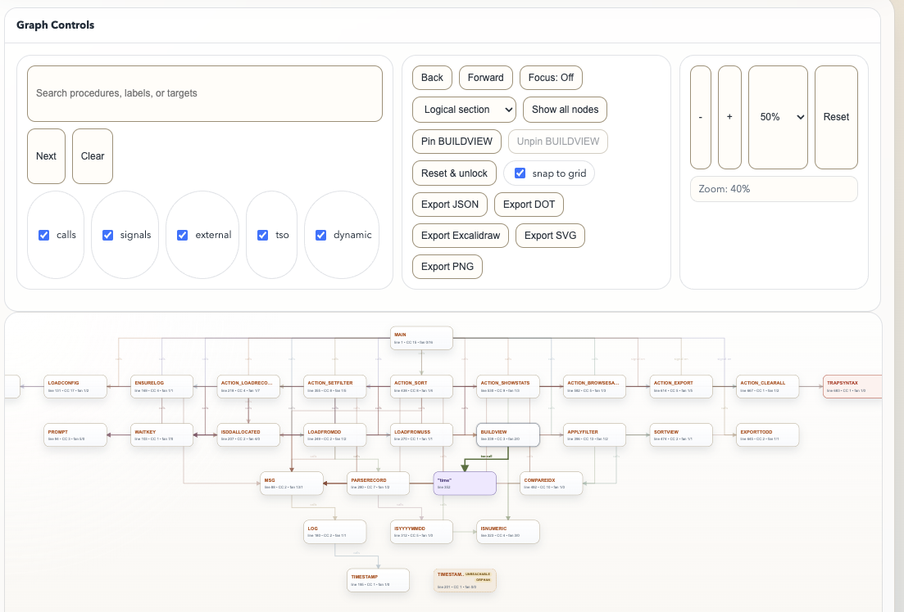

# REXX Control Flow

REXX Control Flow is a VS Code extension that visualizes a procedure-level call graph for REXX and layers control-flow diagnostics on top of it.

_The screenshot highlights the pinned-node lock badge and the manual layout controls for pinning, unpinning, reset layout, and snap-to-grid._

## Features

- Generate an interactive call graph from the active REXX editor.
- Generate a workspace-wide graph across supported REXX files.
- Workspace graphs are built by aggregating per-file control-flow results and can infer a subset of cross-file relationships incrementally; they are not yet full semantic whole-program resolution.
- Auto-refresh the graph when source content changes or is saved.
- Show diagnostics for undefined labels, unreachable procedures, recursive cycles, dead code after unconditional exits, and likely loop risks.
- Surface diagnostics in the VS Code Problems panel for supported REXX files.
- Report source lines that go past the 80-column limit.
- Show per-procedure complexity and fan-in/fan-out metrics.
- Search, filter, group, and collapse large graphs.
- Persist graph UI state such as zoom, filters, focus mode, and group selection across panel recreation with workspace-backed state.
- Keep graph and editor in sync:
  - Selecting a function in the editor moves focus/highlighting in the graph.
  - Clicking a graph node jumps to the function line in the editor.
  - Workspace graph nodes jump to the correct file and line.
- Dynamic line highlighting:
  - Selecting a caller highlights its outgoing call lines.
  - If selected function has no outgoing calls, incoming call lines are highlighted.
- Signal handlers are visually distinct:
  - `SIGNAL ON ... NAME handler` targets are shown as red boxes.
- External LINKMVS program calls are visually distinct:
  - `ADDRESS LINKMVS "program"` adds a blue external-program node using the quoted program name.
- TSO command strings are visually distinct and filterable:
  - command statements that execute through paired double-quoted strings are shown as separate TSO nodes.
- Unused procedures are highlighted
  - Shows procedures not used
- Built-in graph navigation tools:
  - Scroll/trackpad zoom in the graph canvas.
  - Reset zoom button.
  - Mouse panning
  - Back/forward history and focused-procedure mode
  - Drag nodes to make custom layouts while connection lines stay attached
  - Pin moved nodes so their positions persist across rerenders and panel reopen
  - Snap-to-grid toggle for cleaner manual layouts
  - Reset & unlock to restore the automatic graph arrangement
  - JSON, DOT, Excalidraw, SVG, and PNG export buttons in the graph view.
- Editor-native shortcuts:
  - CodeLens actions for opening the graph, the workspace graph, JSON export, and PNG export.
- Export call graph data:
  - JSON export.
  - DOT export (Graphviz format).
  - Excalidraw export opened as an untitled `.excalidraw` document.
  - SVG and PNG export from both the graph UI and command palette.

## Supported graph constructs

- Labels (`label:`) as function entries
- `CALL label` as function-to-function edges
- Function-style expression calls such as `Func(...)`, including calls to labels defined later in the file
- Negated expression calls such as `\Func(...)`
- Dynamic calls (`CALL VALUE ...`, `CALL (...)`) grouped as `DYNAMIC_CALL`
- `SIGNAL ON ... NAME handler` as `signal-on` edges and signal-handler node tagging
- `ADDRESS LINKMVS "program"` / `ADDRESS LINKMVS 'program'` as `external-call` edges to external-program nodes
- paired double-quoted TSO command statements as `tso-call` edges to TSO command nodes, including continued quoted text across lines
- Multiple statements per line separated by `;` (quote-aware splitting)
- Block/in-line comment stripping for parsing

## Usage

1. Open a REXX file.
2. Right-click in the editor.
3. Run **Generate REXX Control Flow**.

From the command palette, you can also run:

- **REXX Control Flow: Generate Workspace REXX Control Flow**
- **REXX Control Flow: Export REXX Control Flow to JSON**
- **REXX Control Flow: Export REXX Control Flow to DOT**
- **REXX Control Flow: Export REXX Control Flow to Excalidraw**
- **REXX Control Flow: Export REXX Control Flow to SVG**
- **REXX Control Flow: Export REXX Control Flow to PNG**

Right-click editor context menu focuses on graph generation (export actions are in the graph toolbar).

## Graph behavior details

- Node color:
  - Standard functions: neutral styling
  - Signal handlers (`SIGNAL ON ... NAME ...`): red styling
  - External LINKMVS programs: blue styling
- Edge color:
  - Calls are colored by target function for easier visual grouping
  - Workspace-inferred cross-file edges are shown with dashed lines
- Selection behavior:
  - Click node once to focus and highlight relevant call lines
  - Click another node to switch highlighted relationship context
- Graph controls:
  - Filter calls, signals, external calls, and dynamic calls
  - Filter TSO command edges separately
  - Group by logical section, recursion cycle, node kind, or file
  - Collapse/expand groups for large programs
  - Drag any node to reposition it in the canvas
  - Pinned nodes show a lock badge (`🔒`)
  - Use **Pin \<node\>** / **Unpin \<node\>** for the selected node
  - Enable **snap to grid** before dragging if you want tidy alignment
  - Use **Reset & unlock** to clear custom positions and return to auto-layout

## Manual layout instructions

1. Open the graph view.
2. Drag a node to move it.
3. The node becomes pinned and keeps its position for later sessions.
4. Use the lock badge (`🔒`) as the visual cue that a node is pinned.
5. Select a node and use **Pin** or **Unpin** in Graph Controls for explicit control.
6. Turn on **snap to grid** before dragging if you want aligned spacing.
7. Use **Reset & unlock** to remove all pinned positions and restore the generated layout.

Manual layouts are also reflected in SVG and PNG exports.

## Settings

- `rexxFlow.customCssFile`: Optional path to a `.css` file that overrides the graph webview look and feel. Use an absolute path or a workspace-relative path.
- Relative custom CSS paths are disabled in untrusted workspaces, and files larger than 64 KB are ignored.
- For safety, custom CSS is sanitized before injection into the webview: external imports, URL-based assets, and legacy executable CSS constructs are stripped.
- `rexxFlow.defaultView`: Choose whether the webview opens in `graph` mode or `detailed` mode. Graph mode keeps diagnostics and advanced controls collapsed by default.

## Exports

- JSON: Raw node/edge data for tooling or automation.
- DOT: Use with Graphviz tools (`dot`, `neato`, etc.).
- Excalidraw: Produces Excalidraw JSON in `.excalidraw` format.
- All exports use a Save dialog with defaults from the active REXX file:
  - default folder: same folder as the source REXX file
  - default file name: source file base name
  - extension set by export type (`.json`, `.dot`, `.excalidraw`, `.svg`, `.png`)

## Testing

- `npm test`: fast Node-based unit and mocked integration tests.
- `npm run smoke`: mocked VS Code-host smoke checks.
- `npm run test:vscode`: real VS Code extension-host harness using `@vscode/test-electron` and the fixture workspace under `vscode-test/fixture-workspace/`.
- `npm run test:vscode` is required in CI; local runs are best-effort because the VS Code test binary download/runtime is comparatively heavy.
- `npm run verify`: local quality gates without launching VS Code.
- `npm run verify:full`: full verification including the real VS Code harness.
- GitHub Actions runs both `npm run verify` and the real `npm run test:vscode` harness under `xvfb` on Ubuntu via `.github/workflows/ci.yml`.

## Notes

- The extension is local-only: it analyzes the active REXX document inside VS Code and does not require authentication, accounts, or cloud access.
- Diagnostics now use additional statement-level analysis inside each procedure to detect dead code and some loop/exit risks.
- Supported file/language IDs: `rexx`, `REXX`, and common file extensions (`.rexx`, `.rex`, `.exec`).
- Works great with the Broadcom Rexx LSP.
- Example CSS file on the github site.
